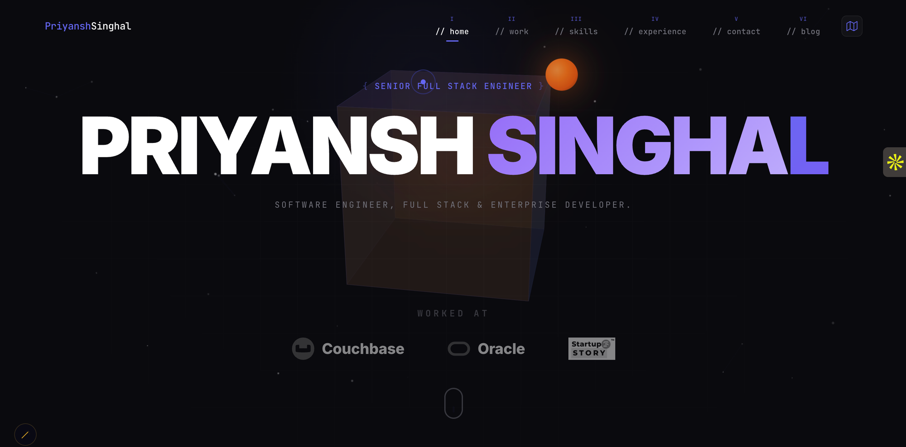

<div align="center">

<!-- Portfolio Banner -->
<a href="https://priyanshsinghal.com/home">
  
</a>

<!-- Social Badges - sleek dark style -->
<a href="https://www.linkedin.com/in/priyanshsinghal/"></a>
<a href="https://medium.com/@singhalpriyansh58"></a>
<a href="https://priyanshsinghal.com/home"></a>
<a href="https://twitter.com/18_priyansh"></a>
<a href="https://www.instagram.com/18_priyansh/"></a>
<a href="mailto:singhalpriyansh58@gmail.com"></a>
<a href="https://www.youtube.com/@18_priyansh"></a>


&nbsp;

&nbsp;


</div>

<!-- Animated Line Divider -->


##  A little more about me...


I'm **Priyansh Singhal** — a **Senior Full Stack Software Engineer @ Couchbase** 

I design and build **enterprise-scale platforms** where org charts aren't boring, workflows audit themselves, and RBAC is taken *very* seriously (because compensation data).

Previously, I survived (and thrived) as an **Associate Application Developer @ Oracle**, shipping production-grade apps with **Java, Spring Boot, React, REST APIs, and PL/SQL** — handling **10K+ daily transactions** without breaking a sweat.

- **M.Tech (CSE)** from **NSUT Delhi** | **B.Tech (CSE)** from **GGSIPU** | **GATE Qualified**
- I write **tech blogs** that turn complex stuff into *"ohhh that makes sense"* moments
- I run a **YouTube channel** — sharing experiences, interview tips, and Oracle kit unboxings
- If it involves **System Design, Backend APIs, React, or why this query is slow** — I'm in

```javascript
const priyansh = {
    role: "Senior Full Stack Software Engineer",
    company: "Couchbase",
    previousCompany: "Oracle",
    education: {
        mtech: "NSUT Delhi (CSE)",
        btech: "GGSIPU (CSE)",
        gate: "Qualified ✓"
    },
    currentlyBuilding: "OrbiGraph — AI-powered enterprise Org Chart platform (Claude Code + Gemini Code Assist)",
    techStack: {
        languages:  ["Java", "TypeScript", "JavaScript", "Python", "C++"],
        frontend:   ["React", "HTML5", "CSS3", "Redux"],
        backend:    ["Spring Boot 3", "Node.js", "Express", "Django"],
        databases:  ["PostgreSQL", "MongoDB", "MySQL", "PL/SQL"],
        cloud:      ["AWS", "Docker", "Microservices"],
        ai:         ["Claude Code", "Gemini Code Assist", "OpenAI GPT-4", "DALL-E 3", "LangChain", "RAG"]
    },
    askMeAbout: ["System Design", "Spring Boot", "React", "SQL Performance", "AI Agents"],
    funFact: "'It worked yesterday' is not a valid root-cause analysis"
};
```

<!-- Animated Line Divider -->


##  Tech Stack

<div align="center">

| **Category** | **Technologies** |
|---|---|
| **Languages** |      |
| **Frontend** |     |
| **Backend** |     |
| **Databases** |    |
| **Cloud & DevOps** |     |
| **AI / ML** |   |

</div>

<!-- Animated Line Divider -->


##  Featured Projects

<table>
<tr>
<td width="50%" valign="top">

###  [Oryn — AI SaaS Platform](https://github.com/priyansh18/Oryn)
AI-powered SaaS integrating **OpenAI GPT-4 & DALL-E 3** for intelligent content generation


[](https://oryn-priyanshsinghal.vercel.app/)

</td>
<td width="50%" valign="top">

###  [OrbiGraph — AI Enterprise Platform](https://github.com/priyansh18)
AI-powered **Org Chart & Back-Office** platform built with **Claude Code, Gemini Code Assist** — intelligent RBAC, smart audit workflows & AI-driven compensation insights


</td>
</tr>
<tr>
<td width="50%" valign="top">

###  [ShopHut — E-Commerce](https://github.com/priyansh18/Shophut)
Full-featured e-commerce fashion platform with **PayPal integration**, cart management & **35+ products**


[](https://shophut-priyanshsinghal.vercel.app/)

</td>
<td width="50%" valign="top">

###  [SceneIt — Movie Discovery](https://github.com/priyansh18/SceneIt)
Movie discovery platform with **OMDB API** & interactive **3D flip card** UI


[](https://sceneit-priyanshsinghal.vercel.app/)

</td>
</tr>
<tr>
<td width="50%" valign="top">

###  [Covid-19 Tracker](https://github.com/priyansh18/Covid-19)
Full-stack pandemic dashboard with **ML-powered data analysis** & real-time chart visualizations


[](https://covid19tracker-priyanshsinghal.vercel.app/)

</td>
<td width="50%" valign="top">

###  More Projects
Check out all **84+ repositories** covering full-stack apps, DSA, utilities & more

[](https://github.com/priyansh18?tab=repositories)
[](https://priyanshsinghal.com/home)

</td>
</tr>
</table>

<!-- Animated Line Divider -->


##  GitHub Stats

<div align="center">


</div>

<!-- Animated Line Divider -->


## &#x270d; Writing & Content


I write about **System Design, Backend Engineering, and AI** — turning complex topics into clear, digestible explanations.

I also run a **YouTube channel**, sharing experiences, interview tips, and Oracle kit unboxings.

<div align="center">

[](https://medium.com/@singhalpriyansh58)
[](https://www.youtube.com/@18_priyansh)

</div>

<!-- Animated Line Divider -->


##  Let's Connect

<div align="center">

<b>If it involves System Design, Backend APIs, AI Agents, or figuring out why that query is slow — let's talk.</b>

[](https://www.linkedin.com/in/priyanshsinghal/)
[](https://priyanshsinghal.com/home)
[](mailto:singhalpriyansh58@gmail.com)

</div>

<!-- Footer Divider -->

